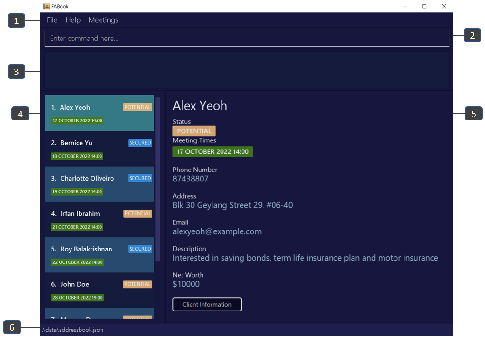
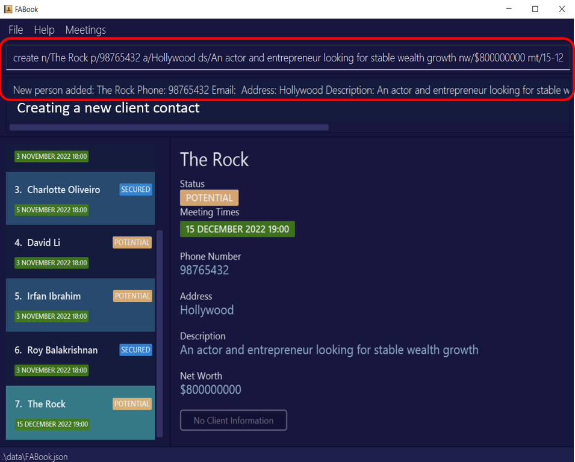
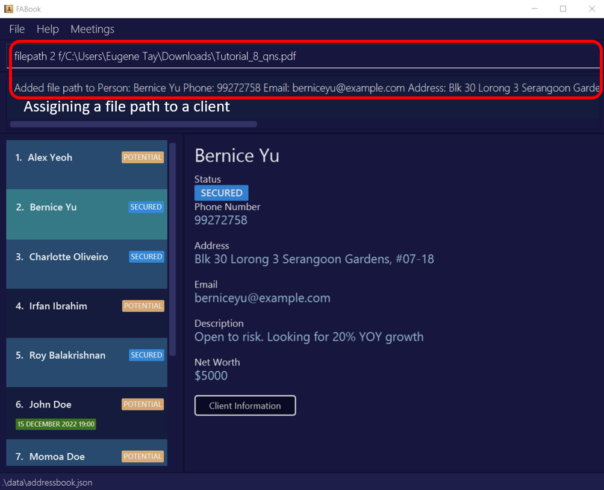
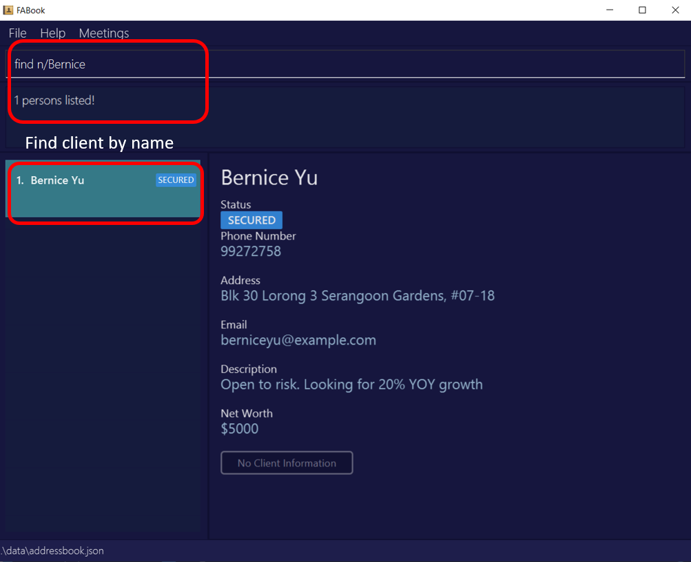
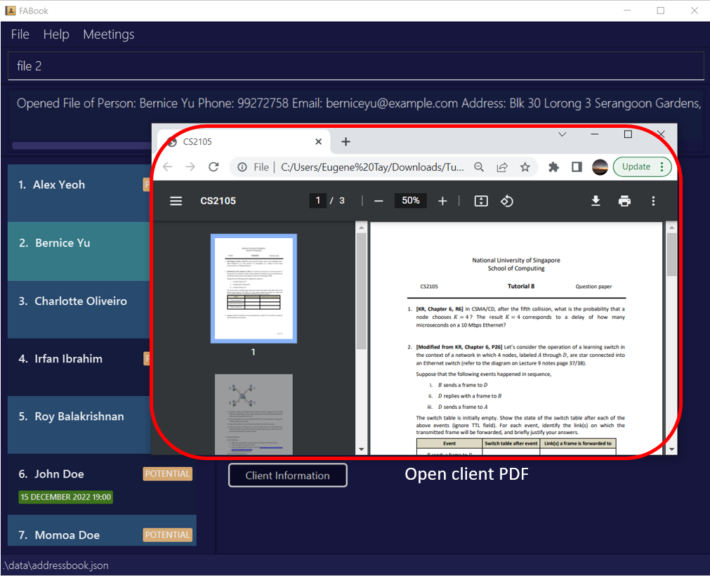
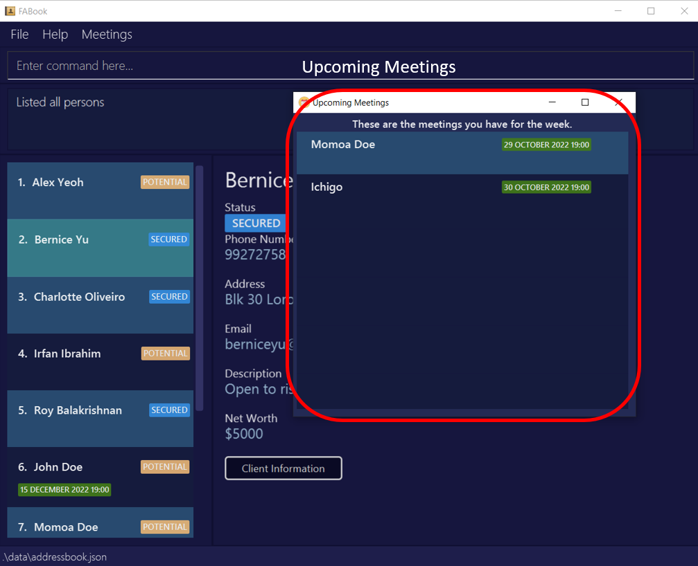
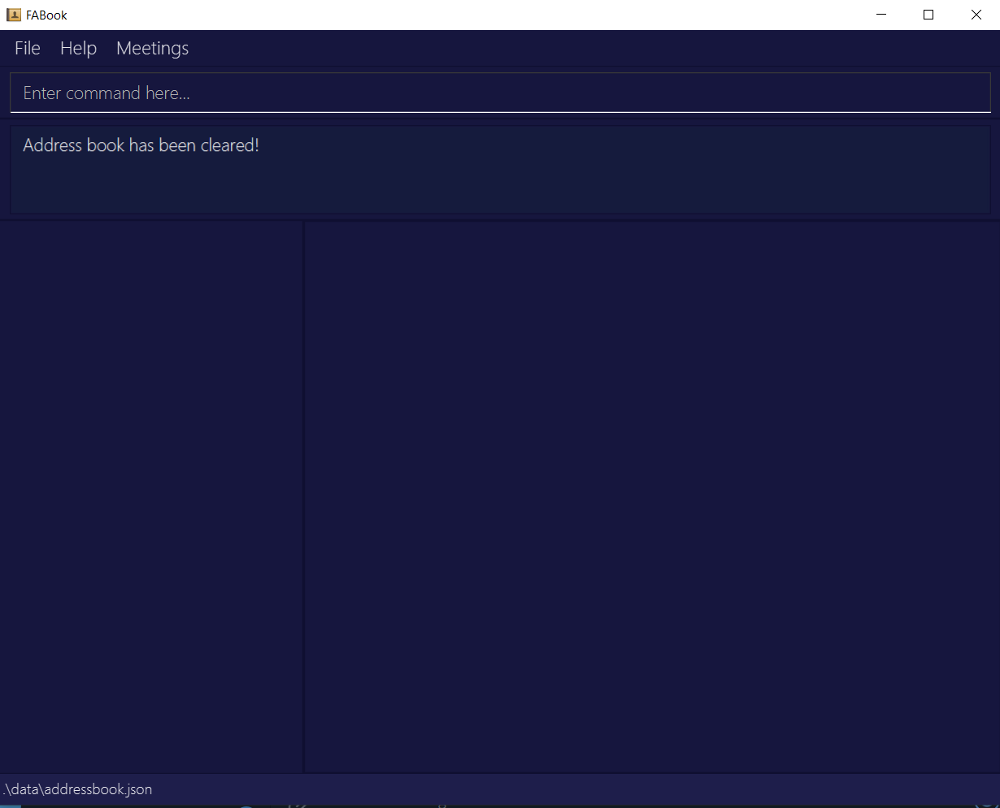
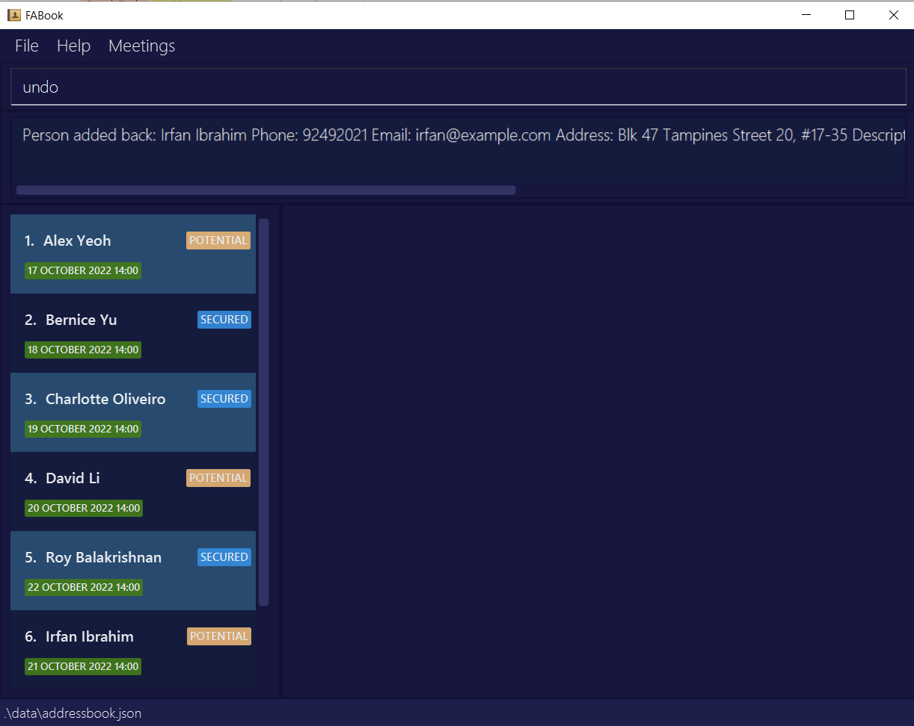
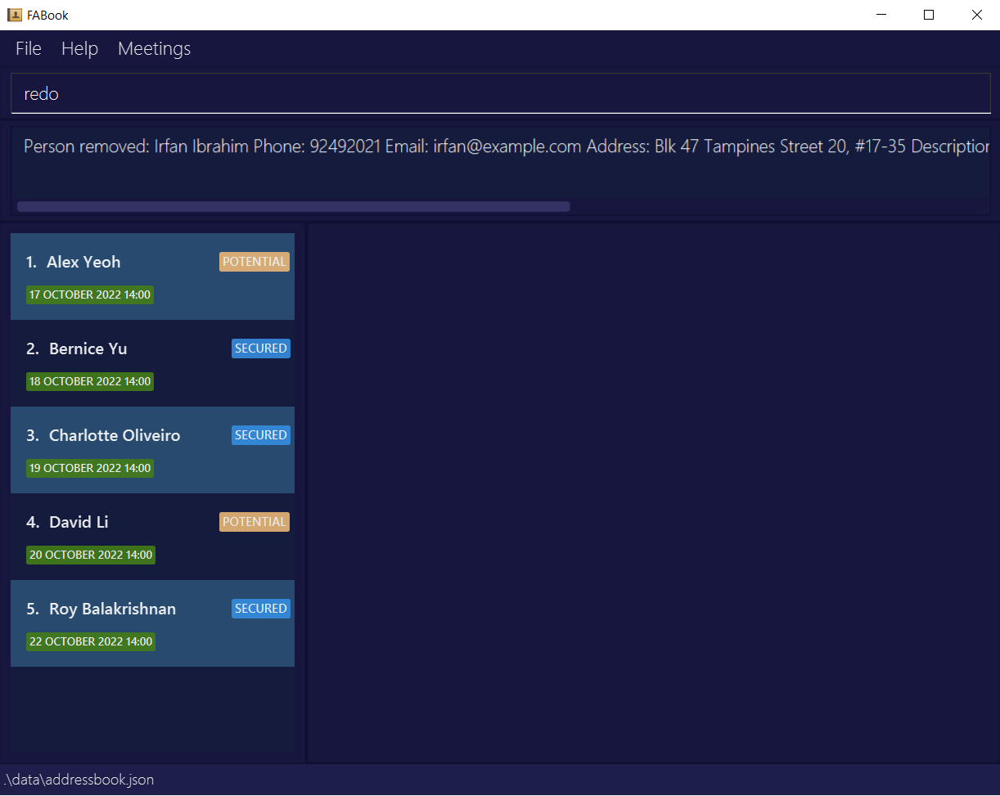

FABook is your **dependable assistant** who **reminds you of meetings** and **consolidates crucial information** like financial plans and client information right at your fingertips! You can now focus on giving your full attention to your clients without having to worry about things slipping your mind.

**FABook is optimized for a financial adviser to use via a Command Line Interface (CLI)** while still having the benefits of a Graphical User Interface (GUI). If you can type fast, FABook can get your contact management tasks done faster than traditional GUI apps.

This user guide will help you get started and understand how FABook can **seamlessly streamline your daily lives**.

* Table of Contents
{:toc}

--------------------------------------------------------------------------------------------------------------------

## Quick start

1. Ensure you have Java `11` or above installed in your Computer.

2. Download the latest `FABook.jar` from [here](https://github.com/AY2223S1-CS2103T-T10-2/tp/releases).

3. Copy the file to the folder you want to use as the _home folder_ for your FABook.

4. Double-click the file to start the app. The GUI similar to the below should appear in a few seconds. Note how the app contains some sample data. 
   

5. Type the command in the command box and press Enter to execute it. e.g. typing **`help`** and pressing Enter will open the help window. 
   Some example commands you can try:

   * **`list`** : Lists all clients.

   * **`create`**`n/John Doe p/98765432 a/John street, block 123, #01-01` : Adds a client named `John Doe` to your FABook.

   * **`exit`** : Exits the app.

6. Refer to the [Features](#features) below for details of each command.
7. Refer to the [Command Summary](#command-summary) for a quick summary of all commands.

--------------------------------------------------------------------------------------------------------------------

## Getting Familiar With Your User Interface

1. **Menu Bar**: Access the file, help or upcoming meetings here.
2. **Search Bar**: Type in your commands here.
3. **Command Display**: The execution of your commands appear here.
4. **Result Display**: The result of your command execution appears here.
5. **Contact Information**: The full contact information of a client appears here.
6. **Data Storage**: This is where the data is stored and loaded from.

--------------------------------------------------------------------------------------------------------------------

## Features

**:information_source: Overview of commands:** 

* Words in `UPPER_CASE` are the information supplied by you.
  e.g `NAME` is a parameter in `create n/NAME`, where you can input `create n/John Doe`. 
   

* Parameters in `[]` are optional.
  e.g `HOME_ADDRESS` is an optional parameter in `create n/NAME [a/HOME_ADDRESS]`, where you can input `create n/John Doe a/Blk 30 Geylang Street 29` or just `create n/John Doe`.
   

* Items with `…`​ after them can be used multiple times.
  e.g `NAME…​` can be used as `Jon`, `Jon Jack` etc.
   

* `INDEX` represents the index of a specific client in your FABook.
  e.g You can use the command `delete INDEX` as `delete 2`.
 

* Parameters can be in **any order**.
  e.g You can input either `create n/NAME p/HP_NUMBER` or ` create p/HP_NUMBER n/NAME`.
   

* Only the last occurrence of a parameter that is expected once will be taken **if you specify it more than once.**
  e.g Given `p/12341234 p/56785678`, only `p/56785678` will be taken.
   

* Extraneous parameters for commands that do not take in parameters (such as `help`, `list`, `exit`,`clear`, `redo` and `undo`) will be ignored.
  e.g. if the command specifies `help 123`, it will be interpreted as `help`.
 

### General

#### Viewing help : `help`

Shows a message explaining how you can access our user guide.

Format: `help` or Press `F1`

#### Listing your clients : `list`

Shows a list of all clients in your FABook.

Format: `list`

 

:white_check_mark: **Input Shortcut:**
You can replace `list` with `l` for convenience.

### Creation

#### Creating a client contact : `create`

Creates a client contact with their information in your FABook. Any contact information you don't have on hand can be updated later.

* If you have multiple meeting times with your client, simply repeat the field `mt/TIME`.
* The `[nw/NETWORTH]` field only accepts inputs that starts with the dollar sign, are numeric,and have more than 4 digits. We want to standardise the currency and the minimum amount net worth of a client.
eg. `nw/$1234`.
* The `[mt/TIME...]` field accepts inputs in the `DD-MM-YYYY-HH:MM` format. Note that `YYYY` cannot be `0000`.

Format: `create n/NAME p/PHONE_NUMBER [e/EMAIL] [a/ADDRESS] [d/DESCRIPTION] [nw/NETWORTH] [mt/TIME...] [t/TAG]`

:bulb: **Note:**
`NAME` and `PHONE_NUMBER` are the only compulsory inputs. Other parameters can be left blank.
                  
Examples:
* `create n/John Doe p/98765432 a/John street, block 123, #01-01`
* `create n/Betsy Crowe a/Bugis MRT p/1234567 mt/10-11-2022-18:00 mt/01-02-2022-16:00`
* `create n/Benedict Lee p/91281329 e/benedict@gmail.com a/Redhill Ave 3 d/Risk averse nw/$20000 mt/10-11-2022-16:00 t/SECURED`

:white_check_mark: **Input Shortcut:**
You can replace `create` with `c` for convenience. 
Format: `c n/NAME p/PHONE_NUMBER [e/EMAIL] [a/ADDRESS] [d/DESCRIPTION] [nw/NETWORTH] [mt/TIME...] [t/TAG]`

#### Assigning PDF file to a client : `filepath`

Assigns a PDF file to a client in your FABook.

* `INDEX` is the index of the client in the currently displayed list.
* The filepath is the absolute path of the PDF on the local disk of your computer. e.g. `C:/Users/Ryzen/Downloads/CS2103T-T08-3.pdf`
* Only file paths that lead to a PDF is allowed. e.g. `C:/Users/Ryzen/Downloads/CS2103T-T08-3.docx` is an invalid filepath.
* Moving or renaming the PDF file in your local disk will not change the client's assigned file path, so you would have to assign it manually.

Format: `filepath INDEX f/FILEPATH`

 

Examples:
* `filepath 2 f/C:/Users/Ryzen/Downloads/CS2103T-T08-3.pdf`

### Retrieving
:white_check_mark: **Input Shortcut:**
You can replace `find` with `f` for convenience for all retrieving commands. 

#### Finding your client by name : `find`

Find your clients whose name contain any of the given keywords.

* The search is case-insensitive. e.g `hans` will match `Hans`
* The order of the keywords does not matter. e.g. `Hans Bo` will match `Bo Hans`
* Only the name is searched. e.g. `find n/Kent` won’t return clients living on Kent Ridge Road
* Partial words will not be matched. e.g. `Jack` will not match `Jackson`.
* Clients matching at least one keyword will be returned (i.e. `OR` search).
  e.g. `Hans Bo` will return `Hans Gruber`, `Bo Yang`

Format: `find n/NAME`

Examples:
* `find n/John` returns `john` and `John Doe`
* `find n/alex david` returns `Alex Yeoh`, `David Li` 
  
:white_check_mark: **Input Shortcut:**
Format: `f n/NAME`
  
#### Finding your client by phone number : `find`

Find your clients whose phone number matches the input number.

* Only full numbers will be matched e.g. `7654` will not match `80765432`
* All clients matching the number will be returned. e.g. All clients in the same household will be returned if they share the same home number.

Format: `find p/NUMBER`

     

Examples:
* `find p/90333333` returns the client(s) with `90333333` stored as their number

:white_check_mark: **Input Shortcut:**
Format: `f p/NUMBER`

#### Finding your client by address : `find`

Find your clients whose addresses matches the input address.

* The search is case-insensitive. e.g `serangoon` will match `Serangoon`
* The order of the keywords does not matter. e.g. `Kio Mo Ang` will match `Ang Mo Kio`
* Only the address is searched. e.g. `find a/Kent` won’t return clients with the name 'Kent'
* Words can be matched only if the whole address is included. e.g. `Tamp` won’t match `Tampines`
* Clients with address matching at least one keyword will be returned (i.e. `OR` search).
  e.g. `Buona Clementi` will return `Buona Vista Drive`, `6 Clementi Ave`
* Address can contain numbers. Find results will return all clients with that address keyword. 
  e.g. `find a/30` will return `Blk 30 Geylang Street 29`, `Blk 30 Lorong 3 Serangoon Gardens`

Format: `find a/ADDRESS`

     

Examples:
* `find a/Bedok` returns the client(s) with `Bedok` stored as their address

:white_check_mark: **Input Shortcut:**
Format: `f a/ADDRESS`

#### Finding your client by tag : `find`

Find your clients whose tag matches the input tag.

* TAG can only be either `SECURED` or `POTENTIAL`
* If multiple tags are given, only the last one is used.

Format: `find t/TAG`

Examples:
* `find t/SECURED` displays the list of all `SECURED` clients.

:white_check_mark: **Input Shortcut:**
Format: `f t/TAG`

#### Opening PDF file of your client : `file`

Opens a client's assigned PDF file in your PDF file viewer.

* `INDEX` is the index of the client in the currently displayed list.
* Moving or renaming the PDF file in your local disk will cause the command to not work, which will require you to reassign a file path to the client again.

Format: `file INDEX`

Examples:
* `file 2`

#### Get upcoming meetings : `Upcoming Meetings`

Returns a list of clients who has a scheduled meeting in the next 7 days.

* This uses your device's present local time as reference.
* As long as a client has a meeting in the next 7 days, it will be shown.

Format: Menu bar on the top of the application or press `F2`.

:heavy_exclamation_mark: **Caution:**
As this command syncs with your device's system clock, please make sure the current date, time, and timezone are correct before using this command.
   
### Updating

#### Updating your client : `update`

Updates the information of a client stored in your FABook.

* Edits the client with the provided index.
* `INDEX` is the index of the client in the currently displayed list. 
* You must provide **at least one** of the optional fields .
* You can also update the description of a client through the [`description` command](#updating-clients-description-description).
* You must update the meeting time of a client through the [`meeting` command](#add-meetings-meeting), [`deletemeeting` command](#delete-meetings-deletemeeting) and [`sync` commands](#remove-past-meetings-sync).

Format: `update INDEX [n/NAME] [p/PHONE_NUMBER] [e/EMAIL] [a/ADDRESS] [d/DESCRIPTION] [nw/NETWORTH] [t/TAG]`
                        
  

:bulb: **Note:**
Only parameters you provide will be changed.

Example:
* `update 2 n/John Doe p/91234567 a/21 Lower Kent Ridge Rd` Updates the second listed client's 
 name, phone number and address to be `John Doe`, `91234567` and `21 Lower Kent Ridge Rd` respectively.

:white_check_mark: **Input Shortcut:**
You can replace `update` with `u` for convenience. 
Format: `u INDEX [n/NAME] [p/PHONE_NUMBER] [e/EMAIL] [a/ADDRESS] [d/DESCRIPTION] [nw/NETWORTH] [t/TAG]`

#### Updating your client's description : `description`

Updates your client's description data field.

* `INDEX` is the index of the client in the currently displayed list.
* Updating description of your client can also be done through the 'update' command. See [Update command](#updating-clients-description-description)

Format: `description INDEX d/DESCRIPTION`

     

:white_check_mark: **Input Shortcut:**
You can replace `description` with `desc` for convenience.
Format: `desc INDEX d/DESCRIPTION`

#### Updating meetings : `meeting`
   
Updates one or more meeting times to your client in your FABook.

* `INDEX` is the index of the client in the currently displayed list.
* `MEETINGTIME` should be in the format `DD-MM-YYYY-HH:MM`.
* mt/ should be put before each separate meeting time.
* The client's existing meeting times remain unchanged.
   
Format: `meeting INDEX mt/MEETINGTIME...`
   
Examples:
* `meeting 2 mt/09-10-2023-23:50 mt/28-02-2020-15:16` adds two meetings to the second client in the displayed list, 
   one at 9 October 2023 23:50, the other at 28 February 2020 15:16.

### Deletion

#### Deleting a client : `delete`

Deletes the specified client from your FABook.

* INDEX is the index of the client in the currently displayed list.
* Deletes the client with the specified index in your FABook.

Format: `delete INDEX`

 

Examples:
* `delete 2` deletes the second client in the currently displayed client list in your FABook.

#### Delete meetings : `deletemeeting`
   
Deletes a meeting from your client in your FABook.

* `INDEX` is the index of the client in the currently displayed list.
* `MEETINGTIME` should be in the format `DD-MM-YYYY-HH:MM`.
* If the given meeting time is not on the list, the client's meetings remain unchanged.

Format: `deletemeeting INDEX mt/MEETINGTIME`
   
Examples:
* `deletemeeting 2 mt/09-10-2023-23:50` deletes the meeting at 9 October 2023 23:50 from the second client in the displayed list,
   if such a meeting was scheduled.

#### Remove past meetings : `sync`

Removes every scheduled meeting time that has already passed.

* This uses your device's present local time as reference. All meetings scheduled to be earlier than the present time will removed.

Format: `sync`

    
   
:heavy_exclamation_mark: **Caution:**
As this command syncs with your device's system clock, please make sure the current date, time, and timezone are correct before using this command.
Please note that undo cannot undo this command!

### Clearing all entries : `clear`

Clears all entries from your FABook.

Format: `clear`

   

:heavy_exclamation_mark: **Important**
If you run this command by accident, you can [undo](#undoing-a-previous-command--undo) the command to restore all previously cleared entries.

:white_check_mark: **Input Shortcut:**
You can replace `clear` with `cl` for convenience.

### Command Flow
#### Undoing a previous command : `undo`                                      

Undos your last command.

* The command intended to be undone should be an undoable command.
* Undoable commands are: `clear`, `create`, `delete`, `description`, `meeting`, `deletemeeting`, `redo` and `update`
* Non-undoable commands are: `exit`, `find `, `help`, `list`, `file`, `sync` and `filepath`

Format: `undo`

 

:heavy_exclamation_mark: **Important**
You can undo a [`redo` command](#redoing-a-previous-command--redo).

#### Redoing a previous command : `redo`

Redos your last undone command.

Format: `redo`

 

### Exiting the program : `exit`

Exits the program.

Format: `exit`

:white_check_mark: **Input Shortcut:**
You can replace `exit` with `e` for convenience.

### Saving the data

Your FABook data are saved in the hard disk automatically after any command that changes the data. This means hassle free saving.

### Editing the data file

FABook data are saved as a text file `[JAR file location]/data/addressbook.json`. If you are an advanced user, you are welcome to update data directly by editing that data file.

:exclamation: **Caution:**
If your changes to the data file makes its format invalid, FABook will discard all data and start with an empty data file at the next run.

--------------------------------------------------------------------------------------------------------------------

## FAQ

**Q**: How do I transfer my data to another Computer? 
**A**: Install the app in the other computer and overwrite the empty data file it creates with the file that contains the data of your previous FABook home folder.

**Q**: Why can I not undo the `sync` command? 
**A**: Meetings that have passed should not need to be undone and be shown again. 

--------------------------------------------------------------------------------------------------------------------

## Command summary

| Action                   | Format, Examples                                                                                                                                                  | Shortcut |
|--------------------------|-------------------------------------------------------------------------------------------------------------------------------------------------------------------|----------|
| **Help**                 | `help`                                                                                                                                                            | f1       |
| **List**                 | `list`                                                                                                                                                            | l        |
| **Create**               | `create n/NAME p/PHONE_NUMBER [e/EMAIL] [a/ADDRESS] [d/DESCRIPTION] [nw/NETWORTH] [mt/TIME] [t/TAG] `  e.g., `create n/Betsy Crowe a/Newgate Prison p/1234567` | c        |
| **Add a File**           | `filepath INDEX f/FILEPATH`  e.g. `filepath 2 f/C:/Users/Ryzen/Downloads/CS2103T-T08-3.pdf`                                                                   |          |
| **Add Meeting**          | `meeting INDEX mt/TIME`   e.g. `meeting 5 mt/19-11-2022-19:00`                                                                                                |          |
| **Find**                 | `find n/NAME…` or `find p/NUMBER` or `find a/ADDRESS`   e.g., `find n/James Jake` or `find p/09122222` or `find a/Jurong`                                      | f        |
| **Find**                 | `find t/TAG`   e.g., `find t/POTENTIAL`                                                                                                                        | f        |
| **Open File**            | `file INDEX`  e.g. `file 2`                                                                                                                                   |          |
| **Get Upcoming Meetings**|                                                                                                                                                                   | f2       |
| **Update**               | `update INDEX [n/NAME] [p/PHONE_NUMBER] [e/EMAIL] [a/ADDRESS] [d/DESCRIPTION] [nw/NETWORTH] [t/TAG]`  e.g.,`update 2 p/91234567 a/21 Lower Kent Ridge Rd`      | u        |
| **Description**          | `description INDEX d/DESCRIPTION`   e.g., `description 3 d/Accident prone`                                                                                     | desc     |
| **Delete**               | `delete INDEX`  e.g., `delete 3`                                                                                                                               | d        |
| **Delete Meeting**       | `deletemeeting INDEX mt/TIME`   e.g. `deletemeeting 4 mt/15-12-2022-13:00`                                                                                    |          |
| **Remove past meetings** | `sync`                                                                                                                                                            |          |
| **Clear**                | `clear`                                                                                                                                                           | cl       |
| **Undo**                 | `undo`                                                                                                                                                            |          |
| **Redo**                 | `redo`                                                                                                                                                            |          |
| **Exit**                 | `exit`                                                                                                                                                            | e        |
